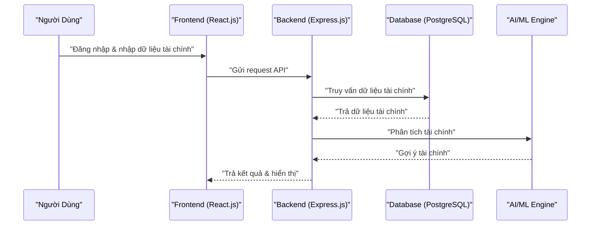

# **Tài Liệu Kỹ Thuật - Ứng Dụng Quản Lý Tài Chính Cá Nhân**

## **1. Giới thiệu**
Ứng dụng này giúp người dùng tổng quan tài chính cá nhân theo mô hình **Bảng Cân Đối, Cấu Trúc Tài Sản, Quy Tắc Chảy Tràn và Tài Chính Độc Lập**. 
Ứng dụng sẽ hỗ trợ người dùng nhập dữ liệu tài chính, phân tích và đưa ra các đề xuất tài chính tối ưu.

---

## **2. Kiến trúc hệ thống**

### **2.1. Tổng quan kiến trúc**
Ứng dụng sử dụng kiến trúc **Client-Server** với:
- **Frontend**: React.js (Netlify hosting)
- **Backend**: Node.js (Express.js) (Railway hosting)
- **Database**: PostgreSQL (Railway)
- **Authentication**: Firebase Auth / Supabase Auth
- **Storage**: Firebase Storage hoặc AWS S3 (nếu cần lưu file dữ liệu người dùng)
- **APIs**: Open Banking API (tích hợp ngân hàng sau này)

```mermaid
graph TD;
    A[Người Dùng] -->|Nhập dữ liệu tài chính| B[Frontend (React.js)];
    B -->|Gửi yêu cầu API| C[Backend (Express.js)];
    C -->|Truy vấn dữ liệu| D[Database (PostgreSQL)];
    C -->|Xác thực| E[Firebase Auth / Supabase Auth];
    D -->|Trả dữ liệu| C;
    C -->|Phân tích tài chính| F[AI / OpenAI API];
    F -->|Gợi ý tài chính| B;
```

### **2.2. Flow tổng quan**
1. Người dùng đăng nhập vào hệ thống.
2. Người dùng nhập dữ liệu tài chính cá nhân.
3. Hệ thống tính toán và hiển thị dữ liệu dưới dạng biểu đồ.
4. Hệ thống cung cấp các đề xuất tài chính dựa trên dữ liệu đã nhập.



---

## **3. Công nghệ sử dụng**
### **3.1. Frontend**
- React.js (Next.js nếu cần SEO tốt hơn)
- TailwindCSS / Material UI (UI/UX)
- Chart.js / D3.js (Biểu đồ tài chính)
- Netlify (Hosting miễn phí)

### **3.2. Backend**
- Node.js (Express.js) làm REST API
- PostgreSQL làm database
- Railway.app để deploy backend
- Redis (caching, nếu cần tối ưu hiệu suất)
- Firebase Auth / Supabase Auth để xác thực người dùng
- OpenAI API (hoặc GPT) để đưa ra tư vấn tài chính (tùy chọn)

---

## **4. Chức năng chính**
### **4.1. Dashboard tổng quan tài chính**
- Hiển thị thông tin tài sản theo bảng cân đối
- Phân tích dòng tiền theo quy tắc chảy tràn
- Biểu đồ minh họa dòng tiền

### **4.2. Quản lý dòng tiền**
- Người dùng nhập dữ liệu thu nhập & chi tiêu
- Hệ thống tự động phân bổ theo quy tắc chảy tràn
- Cho phép người dùng tùy chỉnh quy tắc phân bổ

### **4.3. Cấu trúc tài sản**
- Người dùng nhập các loại tài sản đang có
- Phân loại tài sản theo Thanh Khoản, Tích Lũy, Đầu Tư
- Đề xuất tối ưu hóa tài sản cá nhân

### **4.4. Xác định mức độ tài chính độc lập**
- Tính toán chỉ số độc lập tài chính
- Đề xuất chiến lược tài chính dựa trên mô hình cá nhân

---

## **5. API Backend**
| **API Endpoint** | **Method** | **Chức năng** |
|-----------------|------------|--------------|
| `/auth/login` | POST | Xác thực người dùng |
| `/auth/register` | POST | Đăng ký tài khoản |
| `/user/profile` | GET | Lấy thông tin người dùng |
| `/finance/balance` | GET | Lấy thông tin bảng cân đối |
| `/finance/flow` | POST | Cập nhật dòng tiền |
| `/finance/assets` | GET | Lấy thông tin tài sản |
| `/finance/suggestions` | GET | Đề xuất tài chính |

---

## **6. Lộ trình phát triển**
### **Giai đoạn 1: MVP (Sản phẩm khả dụng tối thiểu)**
- [ ] Thiết kế UI/UX trên Figma
- [ ] Phát triển frontend React.js
- [ ] Xây dựng backend Node.js + Express.js
- [ ] Triển khai PostgreSQL trên Railway
- [ ] Kết nối frontend & backend

### **Giai đoạn 2: Mở rộng**
- [ ] Tích hợp Firebase Auth / Supabase Auth
- [ ] Cải thiện biểu đồ tài chính với D3.js
- [ ] Tích hợp OpenAI API để tư vấn tài chính
- [ ] Phát triển ứng dụng mobile bằng React Native

---

## **7. Tích hợp mở rộng trong tương lai**
- Open Banking API để kết nối tài khoản ngân hàng
- Blockchain để lưu trữ tài sản số
- AI & Machine Learning để tối ưu hóa tài chính cá nhân

---

## **8. Kết luận**
Dự án hướng tới việc giúp người dùng có cái nhìn tổng quan về tài chính cá nhân, từ đó đưa ra các quyết định tài chính đúng đắn. Chúng ta sẽ bắt đầu bằng việc xây dựng MVP, sau đó mở rộng với các tính năng nâng cao.

### 🔥 **Bước tiếp theo:**
- Xây dựng **mockup UI/UX** trên Figma
- Thiết lập **backend trên Railway**
- Viết API **cơ bản trên Express.js**

